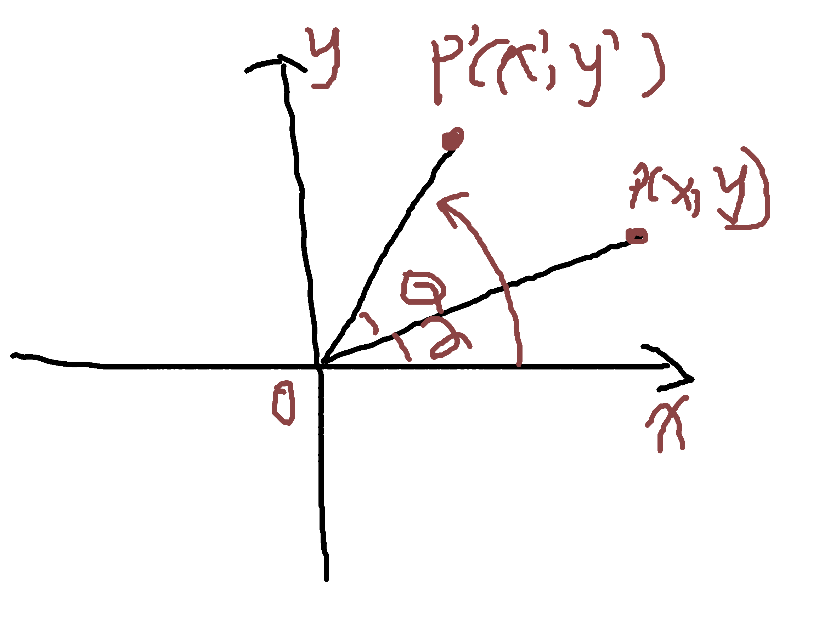

# Rotation Matrix

{#fig:}

P(x,y):

$$
\left\{\begin{matrix}
x = \overline{OP} cos \alpha  & \\
y = \overline{OP} sin \alpha
\end{matrix}\right.
$${#eq:}

After rotation, we get $P \prime (x \prime, y \prime)$:

$$
\left\{\begin{matrix}
x \prime = \overline{OP} cos(\alpha + \theta) \\
y \prime = \overline{OP} sin(\alpha + \theta)
\end{matrix}\right. \\
=
\left\{\begin{matrix}
x \prime = \overline{OP}(cos \alpha cos \theta - sin\alpha\sin \theta) \\
y \prime = \overline{OP}(sin \alpha cos \theta + cos \alpha sin \theta)
\end{matrix}\right. \\
=
\left\{\begin{matrix}
x \prime = x cos \theta - y\sin \theta \\
y \prime = y cos \theta + x sin \theta
\end{matrix}\right.
$${#eq:}

=>

$$
\begin{bmatrix}
{x}'\\
{y}'
\end{bmatrix}
=
\begin{bmatrix}
cos \theta  & -sin\theta \\
sin \theta & cos \theta
\end{bmatrix}
\begin{bmatrix}
x\\
y
\end{bmatrix}
$${#eq:}

# Reference
