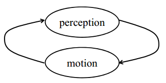

# Percesption and Motion

{#fig:}

In general, environment perception increases the robot’s
knowledge, while motion tends to induce a loss of knowledge
due to the inherent noise in robot actuation and the stochasticity
of robot environments.

# State Prediction and Correction
## Formulation
- Estimate the state of a system given observations and controls [^Robot-Mapping]

Goal: $$p(x|z, u)$$

- **Belief** is the Robot's internal knowledge about the state of the environment.
- **Posterio probability** conditioned on all past controls and measurements
$$bel(x_t)=p(x_t|z_{1:t-1}, u_{1:t})$$
- **Prediction** of the current state, before incorporating the measurement at time t. $$\overline {bel}(x_t) = p(x_t|z_{1:t-1},u_{1:t})$$
- Correction and measurement update process:
$$\overline {bel}(x_t) \rightarrow bel(x_t)$$

## Devrivation of Recursive Bayes Filter

$$
\begin{aligned}
bel(x_t) &= p(x_t|z_{1:t}, u_{1:t}) \\
&= \eta p(z_t|x_t,z_{1:t-1},u_{1:t})p(x_t|z_{1:t-1}, u_{1:t}) \\
&= \eta p(z_t|x_t) p(x_t|z_{1:t-1}, u_{1:t}) \\
&= \eta p(z_t|x_t) \int_{x_{t-1}} p(x_t|x_{t-1}, z_{1:t-1},u_{1:t})p(x_{t-1}|z_{1:t-1},u_{1:t})dx_{t-1} \\
&= \eta p(z_t|x_t) \int_{x_{t-1}} p(x_t|x_{t-1}, u_t) p(x_{t-1}|z_{1:t-1},u_{1:t})dx_{t-1} \\
&= \eta p(z_t|x_t) \int_{x_{t-1}} p(x_t|x_{t-1}, u_t) p(x_{t-1}|z_{1:t-1},u_{1:t-1}) dx_{t-1}  \\
&= \eta p(z_t|x_t) \int_{x_{t-1}} p(x_t|x_{t-1}, u_t) bel(x_{t-1})dx_{t-1}
\end{aligned}
$$

Techniques in Bayes Filter Devrivation:

- Bayes Rule
- Markov assumption
- Law of total probability
Contineous case:
$$
P(A) = \int_B p(A|B)p(B)dB
$$

Discrete case:

$$
P(A) = \sum_B p(A|B)p(B)dB
$$

## Summary
Bayes filter can be written as a two step process

- **Prediction step**

$$
 \overline {bel}(x_t) = \int_{x_{t-1}} p(x_t|x_{t-1}, u_t) bel(x_{t-1})dx_{t-1}
$$

- **Correction step**
$$
bel(x_t) = \eta p(z_t|x_t)  \overline {bel}(x_t)
$$

- Motion model
$$ p(x_t|x_{t-1}, u_t)$$

- sensor or observation model
$$
bel(x_t) = \eta p(z_t|x_t)
$$

# References
[^Robot-Mapping]: Robot Mapping, http://ais.informatik.uni-freiburg.de/teaching/ws13/mapping/
